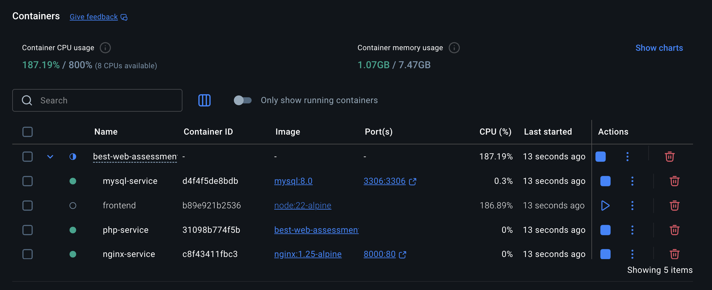
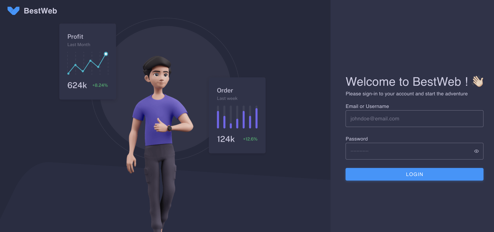
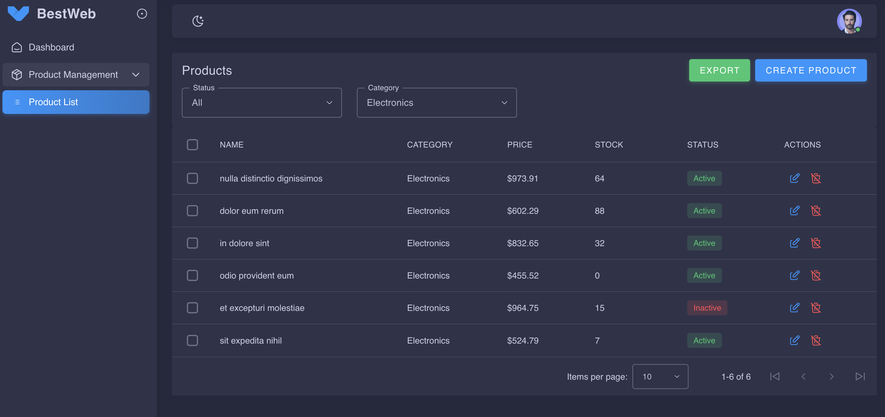
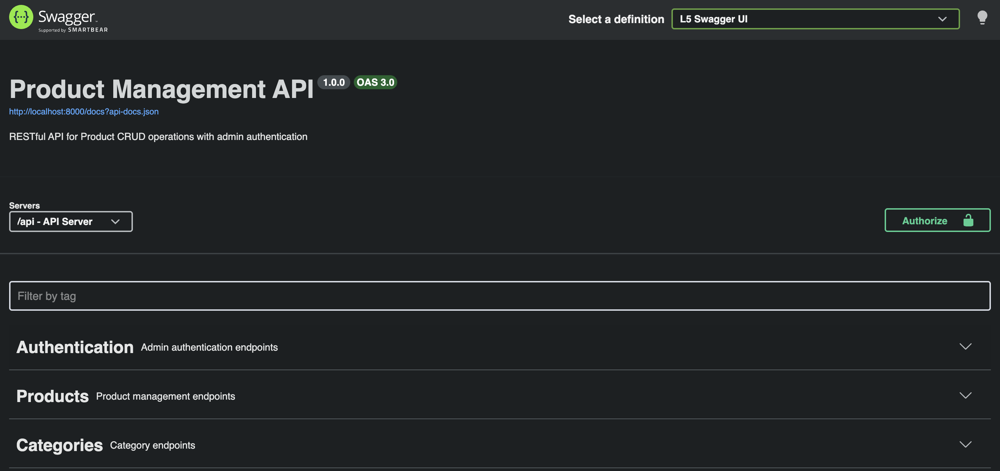

# Best Web Assessment

A Laravel + Vue.js application with Docker support.

## Tech Stack

- **Backend**: Laravel 12 (PHP 8.4)
- **Frontend**: Vue.js 3 + Vuetify + Vite
- **Database**: MySQL 8.0
- **Server**: Nginx
- **Authentication**: Laravel Sanctum (Token-based)
- **API Docs**: L5-Swagger (OpenAPI 3.0)
- **Excel Export**: maatwebsite/excel

## Prerequisites

- [Docker](https://www.docker.com/get-started) installed
- [Docker Compose](https://docs.docker.com/compose/install/) installed

## Quick Start

### Step 1: Clone the Repository

```bash
git clone https://github.com/kelvintan323/best-web-assessment.git
cd best-web-assessment
```

### Step 2: Setup Environment File

```bash
cp .env.docker .env
```

The default configuration uses:
- **Database**: `best_web`
- **Username**: `root`
- **Password**: (empty)
- **Host**: `mysql` (Docker container name)

### Step 3: Build Docker Containers

```bash
make build
```

### Step 4: Start Containers

```bash
make up
```



This starts 4 containers:

| Container | Port | Description |
|-----------|------|-------------|
| `php-service` | 9000 (internal) | PHP-FPM application |
| `nginx-service` | **8000** | Nginx web server |
| `mysql-service` | **3306** | MySQL database |
| `frontend` | - | Frontend build (only runs once) |

### Step 5: Install Dependencies & Setup Database

```bash
make install
```

This command will:
1. Install Composer dependencies
2. Generate application key
3. Run database migrations
4. Seed the database

### Step 6: Access the Application

Open your browser and visit:

- **Application**: http://localhost:8000
- **Swagger API Docs**: http://localhost:8000/api/documentation

**Default Admin Credentials:**
| Email | Password |
|-------|----------|
| admin@test.com | 12345678 |







## Available Commands

| Command | Description |
|---------|-------------|
| `make up` | Start all containers |
| `make down` | Stop all containers |
| `make build` | Build containers (no cache) |
| `make install` | Install dependencies and setup database |
| `make migrate` | Run database migrations |
| `make seed` | Run database seeders |
| `make fresh` | Fresh migration with seeding |
| `make frontend` | Rebuild frontend (clean install) |
| `make shell` | Access app container bash |
| `make logs` | View container logs |
| `make clear` | Clear Laravel caches |
| `make test` | Run tests |
| `make swagger` | Generate Swagger documentation |

## Development Workflow

### After Making Frontend Changes (Vue/JS/CSS)

```bash
make frontend
```

### After Making Backend Changes (PHP)

Changes are reflected immediately - no action needed.

### After Changing Nginx Config

```bash
docker-compose restart nginx
```

### After Changing Docker Config (Dockerfile/docker-compose.yml)

```bash
make down
make build
make up
```

## Troubleshooting

### Permission Issues

```bash
docker-compose exec app chmod -R 775 storage bootstrap/cache
```

### Database Connection Refused

Make sure your `.env` file has:
```
DB_HOST=mysql
```
**Not** `127.0.0.1` (that's for local development without Docker).

### Clear All Caches

```bash
make clear
```

### Reset Database

```bash
make fresh
```

### Reset Everything (Nuclear Option)

```bash
make down
docker volume rm best-web-assessment_mysql-data
rm -rf frontend/node_modules
make build
make up
make install
```

## Swagger Documentation

This project uses [L5-Swagger](https://github.com/DarkaOnLine/L5-Swagger) with **PHP 8 Attributes** to generate OpenAPI 3.0 documentation.

### Access

- **URL**: http://localhost:8000/api/documentation

### Regenerate Docs

After modifying API endpoints or adding new ones:

```bash
make swagger
# or
docker-compose exec app php artisan l5-swagger:generate
```

### API Tags

The API is organized into the following tags:

| Tag | Description |
|-----|-------------|
| Authentication | Admin login/logout endpoints |
| Products | Product CRUD operations |
| Categories | Category listing |

### Authentication

All protected endpoints use **Bearer Token** authentication. After logging in via `/api/login`, include the token in the `Authorization` header:

```
Authorization: Bearer <your-token>
```

### Adding New Documentation

API documentation uses PHP 8 Attributes in controller files. Example:

```php
use OpenApi\Attributes as OA;

#[OA\Get(
    path: '/api/example',
    summary: 'Example endpoint',
    tags: ['Example'],
    responses: [
        new OA\Response(response: 200, description: 'Success')
    ]
)]
public function example() { ... }
```

The base OpenAPI configuration is defined in [Controller.php](app/Http/Controllers/Controller.php).

## API Endpoints

All API endpoints require authentication via Bearer token. Login first to obtain a token.

### Authentication

| Method | Endpoint | Description |
|--------|----------|-------------|
| POST | `/api/login` | Admin login, returns Bearer token |
| POST | `/api/logout` | Logout (invalidate token) |
| GET | `/api/me` | Get current authenticated user |

### Products

| Method | Endpoint | Description |
|--------|----------|-------------|
| GET | `/api/products` | List all products (with pagination) |
| GET | `/api/products?status=1` | Filter by status (1=enabled, 0=disabled) |
| GET | `/api/products?category_id=1` | Filter by category |
| GET | `/api/products?per_page=25` | Set pagination size |
| GET | `/api/products/{id}` | Get single product |
| POST | `/api/products` | Create new product |
| PUT | `/api/products/{id}` | Update product |
| DELETE | `/api/products/{id}` | Delete product (soft delete) |
| POST | `/api/products/bulk-delete` | Bulk delete products |
| GET | `/api/products/export` | Export products to Excel |

### Categories

| Method | Endpoint | Description |
|--------|----------|-------------|
| GET | `/api/categories` | List all categories |

### Request/Response Examples

**Create Product Request:**
```json
{
  "name": "Product Name",
  "category_id": 1,
  "description": "Product description",
  "price": 9999,
  "stock": 50,
  "is_enabled": true
}
```

**Product Response:**
```json
{
  "data": {
    "product": {
      "id": 1,
      "name": "Product Name",
      "category_id": 1,
      "description": "Product description",
      "price": 9999,
      "stock": 50,
      "is_enabled": true,
      "category": {
        "id": 1,
        "name": "Electronics"
      }
    }
  }
}
```

**Bulk Delete Request:**
```json
{
  "ids": [1, 2, 3]
}
```

## Assumptions & Design Choices

### Architecture
- **MVC Pattern**: Laravel's standard MVC architecture is used for clean separation of concerns
- **RESTful API**: All endpoints follow REST conventions with proper HTTP methods and status codes
- **SPA Frontend**: Vue.js 3 with Vuetify for a modern, responsive admin dashboard

### Database Design
- **Soft Deletes**: Products use soft deletes to preserve data integrity and allow recovery
- **Price in Cents**: Prices are stored as integers (cents) to avoid floating-point precision issues
- **One-to-Many Relationship**: Categories have many products, products belong to one category

### Authentication & Security
- **Laravel Sanctum**: Token-based API authentication for stateless requests
- **Admin Guard**: Separate admin authentication guard from regular users
- **Form Request Validation**: All inputs are validated using dedicated Form Request classes (`ProductRequest`, `BulkDeleteProductRequest`) with custom error messages

### Frontend
- **File-based Routing**: Using `unplugin-vue-router` for automatic route generation
- **Vite Build**: Frontend is built and served from Laravel's public directory
- **Relative API URLs**: API calls use `/api` prefix to avoid CORS issues in Docker

### Performance
- **Eager Loading**: Category relationship is eager loaded with products to prevent N+1 queries
- **Pagination**: All list endpoints support pagination for large datasets
- **Database Indexing**: Foreign keys are indexed for faster queries

### Testing
- **Feature Tests**: PHPUnit tests cover all CRUD operations and edge cases
- **Factory Pattern**: Using Laravel factories for test data generation
- **RefreshDatabase**: Each test runs with a fresh database state

### Deployment
- **Docker**: Multi-container setup with PHP-FPM, Nginx, MySQL, and Node.js
- **Makefile**: Simplified commands for common operations
- **Environment Variables**: All configuration via `.env` file

## Testing

Run the test suite:

```bash
make test
# or
docker-compose exec app php artisan test
```

### Test Coverage

The test suite includes **17 feature tests** covering:

| Test | Description |
|------|-------------|
| List products | Pagination, filtering by status/category |
| Show product | Single product retrieval, 404 handling |
| Create product | Validation, required fields, category existence |
| Update product | Field updates, validation |
| Delete product | Soft delete verification |
| Bulk delete | Multiple product deletion, ID validation |
| Export | Excel file generation |
| Authentication | Unauthenticated access rejection |
| Relationships | Category data included in responses |

## Project Structure

```
.
├── app/                    # Laravel application
├── frontend/               # Vue.js frontend
│   ├── src/
│   │   ├── pages/         # Vue pages (file-based routing)
│   │   ├── components/    # Vue components
│   │   └── layouts/       # Layout components
│   └── package.json
├── public/                 # Public assets (frontend build output)
├── docker/
│   ├── nginx/default.conf # Nginx configuration
│   └── php/local.ini      # PHP configuration
├── docker-compose.yml      # Docker services
├── Dockerfile             # PHP-FPM image
├── Makefile               # Shortcut commands
└── .env.example           # Environment template
```

## License

This project is open-sourced software.
